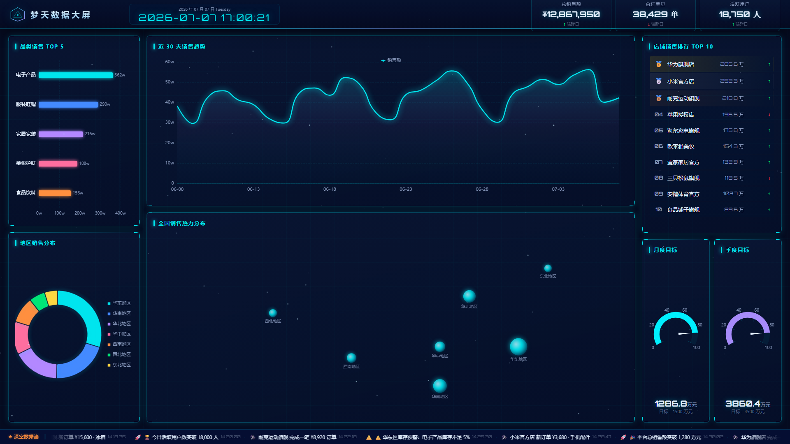

<p align="center">
  
  
  
  
  
  
</p>

<h1 align="center">🌌 梦天数据大屏</h1>
<p align="center"><strong>DreamHeavenScreen</strong> — 航天深空风企业数据监控中心</p>

---



---

## ✨ 特性

- 🎨 **航天深空视觉** — 深空墨蓝底色 + 航天青发光 + 星云紫/星际橙辅色
- 📊 **6 大图表模块** — 折线趋势、柱状品类、环形地区、星球热力、店铺排行、进度仪表盘
- ⚡ **实时数据刷新** — 每 5 秒自动增量更新，数字滚动动画
- 🌌 **星空粒子背景** — Canvas 2D 星点缓慢流动 + 星轨弧线
- 🧩 **适配器架构** — Mock / API 一键切换，修改 `.env` 即可
- 🧪 **完善测试** — Vitest 单元 + 组件测试，TypeScript 严格模式

## 🚀 快速开始

```bash
# 安装依赖
npm install

# 启动开发服务器
npm run dev

# 浏览器打开 http://localhost:5173
```

## 🛠 技术栈

| 类别 | 选型 | 版本 |
|------|------|------|
| 框架 | Vue 3 Composition API | ^3.5 |
| 语言 | TypeScript 严格模式 | ~5.6 |
| 构建 | Vite | ^6.0 |
| 图表 | ECharts 5 按需引入 | ^5.5 |
| 状态 | Pinia | ^2.2 |
| CSS | UnoCSS 原子化 | ^0.65 |
| Mock | MSW + 直接适配器 | ^2.6 |
| 测试 | Vitest + Playwright | ^2.1 / ^1.48 |
| 质量 | ESLint + Prettier + Husky + Commitlint | |

## 📂 目录结构

```
src/
├── adapters/          # 数据适配器 (Mock / API)
├── composables/       # 业务逻辑 (useClock/useCharts/useDashboard...)
├── stores/            # Pinia 状态管理
├── mocks/             # Mock 数据
├── components/
│   ├── layout/        # DashboardLayout / PanelContainer
│   ├── header/        # GlobalHeader (Logo + 时钟 + 全局KPI)
│   ├── kpi/           # KPICard / KPIContrastCard / KPIGauge
│   ├── charts/        # BarChart / LineChart / PieChart / MapChart
│   ├── ranking/       # RankList (Top10 排行)
│   ├── realtime/      # RealtimeTicker (深空数据流)
│   ├── particles/     # ParticleBackground (星空粒子)
│   └── common/        # CountUpNumber / TrendArrow
├── utils/             # Logger / ErrorHandler / Format / ECharts主题
└── __tests__/         # 单元测试 + 组件测试 + E2E
```

## 📸 自动截图

```bash
# 1. 先启动开发服务器
npm run dev

# 2. 另开终端执行截图
npm run screenshot
```

截图保存至 `docs/screenshot.png`。

## 🔄 数据源切换

```env
# .env.development — Mock 模式（默认）
VITE_DATA_SOURCE=mock

# .env.production — API 模式
VITE_DATA_SOURCE=api
```

切换后无需改动任何业务代码，适配器工厂自动选择对应实现。

## 🧪 测试

```bash
npm run test          # 运行全部单元 + 组件测试
npm run test:e2e      # Playwright E2E 测试
npm run typecheck     # TypeScript 类型检查
npm run lint          # ESLint 检查并修复
```

## 📋 页面模块

| 区域 | 模块 | 说明 |
|------|------|------|
| 顶部 | 标题栏 + 实时时钟 + 3 个全局 KPI | 总销售额 / 总订单量 / 活跃用户 |
| 左侧 | 品类销售 TOP 5 | 横向柱状图，渐变色柱 |
| 左侧 | 地区销售分布 | 7 大区环形饼图，右侧图例 |
| 中间 | 近 30 天销售趋势 | 折线图，航天青→星云紫渐变面积 |
| 中间 | 全国销售热力分布 | 散点气泡图，星球天体质感 |
| 右侧 | 店铺销售排行 TOP 10 | 前三名金银铜高亮 |
| 右侧 | 月度/季度目标仪表盘 | 双环形进度，金额外置 |
| 底部 | 深空数据流 | 实时通知无缝滚动 |

## 📄 License

MIT © [wasabi553](https://github.com/wasabi553)
